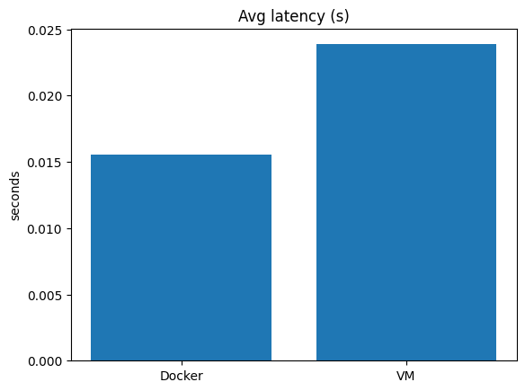

# Flask VM vs Docker Benchmark (CPU-spiky endpoint)

This project compares performance of a simple Flask app running in a Docker container vs a Vagrant VM.
The app includes a compute-heavy `/primecount?n=...` endpoint to generate measurable CPU + memory pressure.

## Quick start

```bash
# prerequisites: Docker, Vagrant (+ VirtualBox), Python 3.11
python3 -m venv .venv && . .venv/bin/activate
pip install -r app/requirements.txt

# run all (build, run docker+vm, benchmark, plots, README update)
bash scripts/collect_all.sh
```

**Images push (optional):**

```bash
export REGISTRY=ghcr.io/<you> IMAGE_NAME=flask-bench IMAGE_TAG=$(git rev-parse --short HEAD)
export DOCKER_USERNAME=<you> DOCKER_PASSWORD=<token>
bash scripts/build_and_push.sh
```

<!-- AUTO-BENCHMARKS -->

### VM vs. Docker Summary

| Metric | Docker | VM |
|---|---:|---:|
| Startup time (s) | 0.767 | 23.845 |
| Avg latency (s) | 0.016 | 0.024 |
| P95 latency (s) | 0.018 | 0.029 |
| Throughput (RPS est.) | 12844.376 | 8379.606 |
| RSS memory (MiB, sampled) | ~37.2 | ~27.9 |
| CPU util (% proc, sampled) | ~23.0% | ~27.1% |


<p align="center">
  
  <br/>
  
  <br/>
  
  
</p>

<!-- AUTO-BENCHMARKS -->

