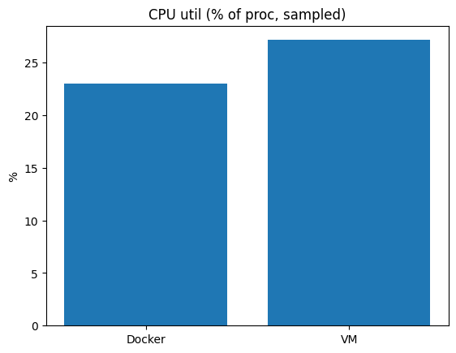
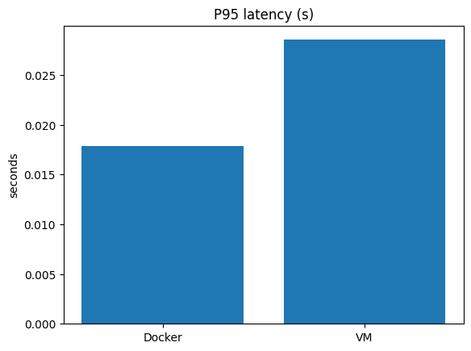
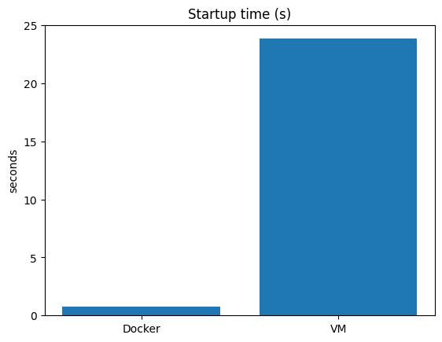
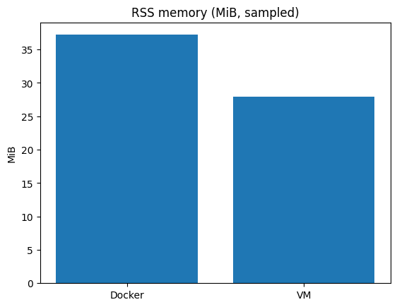
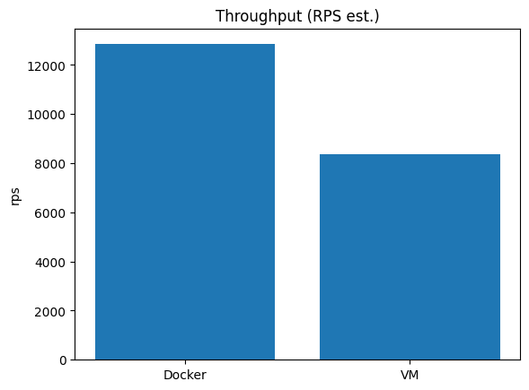

<div align="center">

# Flask VM vs Docker Benchmark

CPU-heavy Flask app benchmarked in Docker vs Vagrant VM on a developer laptop.

</div>

## Overview

This repository compares the performance characteristics of the same Flask application when deployed in:

- a Docker container (Gunicorn, single worker)
- a Vagrant VM (Ubuntu Jammy on VirtualBox, Gunicorn single worker)

It focuses on CPU-heavy work via a compute-bound endpoint to create measurable load and highlight runtime and environment overheads.

Measured metrics:

- Startup time: cold start to first successful `/health`
- Latency: average, p50, p95 under load
- Throughput: estimated requests/sec
- Process CPU and RSS memory: sampled during load

All results are reproducible locally on Linux/macOS and are summarized below with plots.

## Requirements

- Python 3.11
- Docker (daemon running)
- Vagrant + VirtualBox
- Ensure ports `8000` (Docker) and `8001` (VM forwarded port) are free

Recommended laptop spec for consistent results: 16GB RAM, Intel i5‑12500H (or comparable), stable AC power.

## Repo Layout

```
.
├── app/
│   ├── app.py               # Flask app with CPU-heavy /primecount endpoint
│   ├── wsgi.py              # WSGI entrypoint (works as module or package)
│   ├── requirements.txt
│   └── tests/
│       └── test_app.py
├── docker/
│   └── Dockerfile
├── vagrant/
│   ├── Vagrantfile          # Ubuntu Jammy, 2 CPU, 2GB RAM, port 8001 -> 8000
│   └── provision.sh         # Creates venv, installs deps, runs Gunicorn
├── bench/
│   ├── config.yaml          # Trials, load params, URLs
│   ├── bench.py             # Orchestrates runs, metrics, writes results.json
│   ├── vm_metrics.py        # One-shot VM process metrics helper
│   ├── vm_sampler.py        # In-guest sampler to JSONL (CPU%, RSS)
│   └── plot_results.py      # Generates PNG plots
├── scripts/
│   ├── run_docker.sh        # Build and run container, wait for /health
│   ├── run_vm.sh            # Boot VM, wait for /health
│   ├── build_and_push.sh    # Build and push image (placeholders)
│   ├── collect_all.sh       # Full pipeline: test -> run -> bench -> plot -> README
│   └── update_readme.py     # Refresh README results section from results.json
├── README.md                # You are here
└── .gitignore
```

## The App (CPU-heavy Endpoint)

- `GET /health` → `{ "status": "ok" }`
- `GET /primecount?n=300000` → Counts primes ≤ n using a Sieve of Eratosthenes.
  - Heavily CPU-bound by design; adjust `n` in `bench/config.yaml`.

## Quick Start

```bash
# prerequisites: Docker, Vagrant (+ VirtualBox), Python 3.11
python3 -m venv .venv && . .venv/bin/activate
pip install -r app/requirements.txt

# End-to-end: build, run Docker + VM, benchmark, plots, README update
bash scripts/collect_all.sh
```

On the first run, Vagrant will download the base box and set up packages; this can take several minutes.

## Configuration

`bench/config.yaml` controls load and environment:

- `trials`: number of benchmark trials (default: 5)
- `prime_n`: n for `/primecount` (default: 300000)
- `concurrency`: threads for client load (default: 8)
- `requests`: total request count per trial (default: 200)
- `docker_url`: `http://localhost:8000`
- `vm_url`: `http://localhost:8001`

## How Metrics Are Measured

- Docker startup time: from `docker run -d` until `/health` becomes available.
- VM startup time: from a cold boot (`vagrant halt -f` then `vagrant up --provision`) until `/health` becomes available.
- Latency and throughput: client-side timings under concurrent threaded load.
- CPU and memory:
  - Docker: samples `docker stats --no-stream` for container CPU% and memory.
  - VM: samples the Gunicorn worker’s process CPU% and RSS via an in-guest `psutil` sampler writing JSONL files, pulled back after trials.

Design choices for comparability:

- Single Gunicorn worker in both environments.
- Same app code and workload in both targets.
- Repeat trials, compute mean and population stdev.
- Matplotlib for basic, readable PNG plots.

## Running Pieces Individually

```bash
# Start only the Docker target (serves http://localhost:8000)
IMAGE="test/flask-bench" TAG="local" ./scripts/run_docker.sh

# Start only the VM target (serves http://localhost:8001)
./scripts/run_vm.sh

# Run just the benchmark + plots (assumes both targets are already up)
python3 bench/bench.py
python3 bench/plot_results.py
python3 scripts/update_readme.py
```

## Results

The table and plots below are auto-generated by the benchmarking pipeline and updated here on each run.

<!-- AUTO-BENCHMARKS -->

<!-- AUTO-BENCHMARKS -->

Artifacts are written to `bench/out/`:

<p align="center">
  
  <br/>
  
  
  
  
</p>

## Pushing Images (Optional)

```bash
export REGISTRY=ghcr.io/<you>
export IMAGE_NAME=flask-bench
export IMAGE_TAG=$(git rev-parse --short HEAD)
export DOCKER_USERNAME=<you>
export DOCKER_PASSWORD=<token>
bash scripts/build_and_push.sh
```

## Troubleshooting

- Ports in use: ensure `8000`/`8001` are free or edit mappings (Dockerfile and `vagrant/Vagrantfile`).
- Vagrant shared folders/Guest Additions mismatch: VM still works; if folder sync fails, reload or install matching Guest Additions.
- VM fails to reach `/health`: check `/project/vm_gunicorn.log` inside the VM (`vagrant ssh`), verify Python venv exists, and `app.wsgi:application` imports.
- Docker “pytest not found”: tests are run inside the app image; add `pytest` to a dev requirements if you want strict test gating.
- Performance noise: close background apps, plug in power, run a few times and compare averages/stdev.

## Notes

- Repository created fresh; only scaffolding design was inspired by a separate project. No application code was copied.
- This is intended for local benchmarking; do not expose the app on the public Internet without hardening.

## VM vs Container — CI/CD with GitHub Actions + GHCR

This repo includes CI/CD that works whether you already have an app or not.

* **CI** (push/PR): Lint with Ruff, run PyTest if tests are present, upload JUnit.
* **CD** (push to `main`, tags `v*`): Detect a Dockerfile, build the image, push to **GHCR** with `latest` and `<git-sha>` tags.
* Optional **deploy webhook** posts a JSON payload after publish if `DEPLOY_WEBHOOK_URL` is set.

## Status Badges


## Local Dev

```bash
# If you use the sample app:
python3 -m venv .venv && source .venv/bin/activate
pip install -r sample_app/requirements.txt
uvicorn sample_app.app:app --host 0.0.0.0 --port 8000
```

## CI/CD

* Workflows live in `.github/workflows/`.
* CI triggers on push and PR; CD triggers on push to `main` and on tags `v*`.
* Images publish to: `ghcr.io/yash-kalathiya/VM-vs-Container:{latest,<git-sha>}` (lowercased by the workflow).

### Permissions

```yaml
permissions:
  contents: read
  packages: write
```

This enables `GITHUB_TOKEN` to push to GHCR.

### Optional Deploy Webhook

Create a repo secret: **DEPLOY_WEBHOOK_URL**
Example payload: `docs/deploy_webhook_example.json`.

## Decisions & Challenges

See `docs/ci_cd_decisions.md`.
